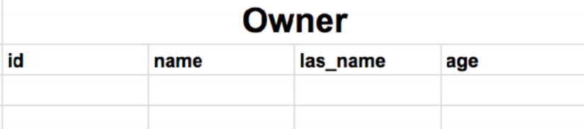
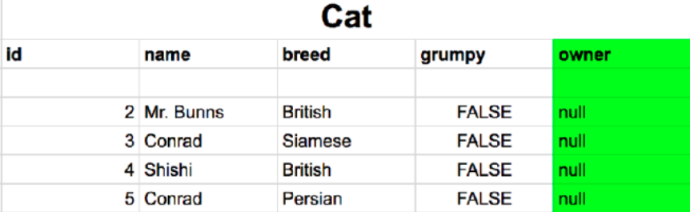
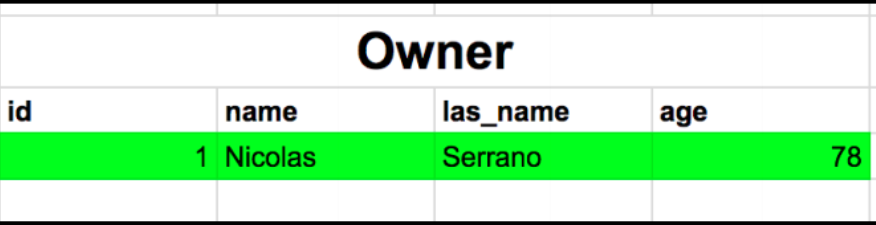
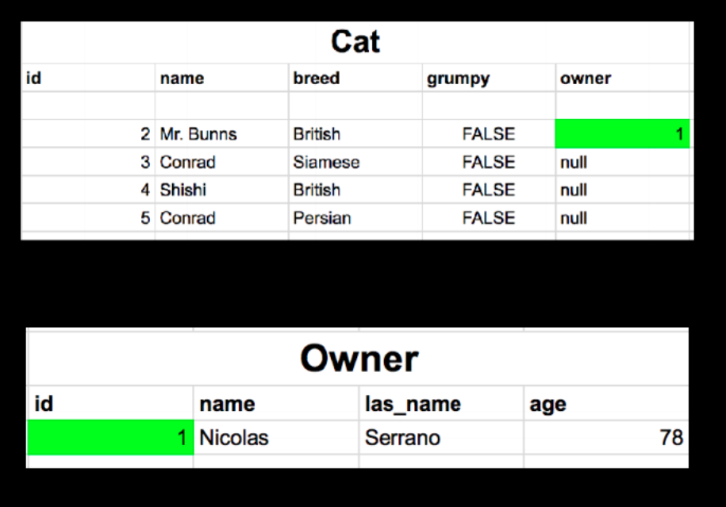
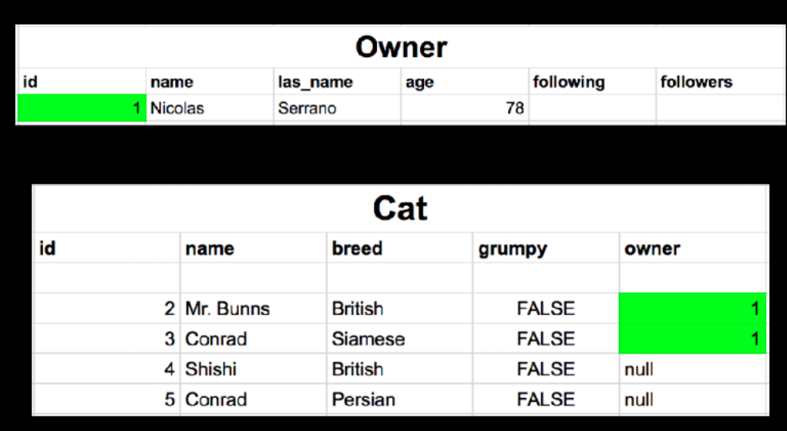
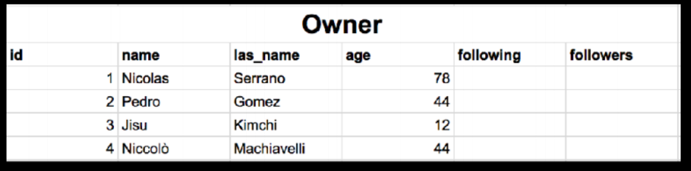
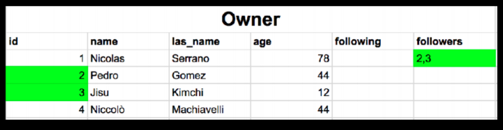

# Model Relationship

OneToOne, OneToMany(Foreignkey), ManyToMany


## OneToOne



```python
from django.db import models

class Owner(models.Model):
    name = models.CharField(max_length=100)
    last_name = models.CharField(max_length=100)
    age = models.IntegerField()
```

Owner 모델 만들기. 
name 은 문자열로 field이고 최고 길이는 100으로 잡아주었다.
last_name 도 같은 속성의 필드를 잡아주었고,
나이는 정수형 숫자로 잡아주었다.


## OneToMany/ManyToOne(Foreignkey)



 한 명의 주인이 여러마리 고양이들을 기르는 관계를 생각해보자. 

정확히 말하면 한 명의 주인이 여러마리의 고양이들을 기를 수 있는 관계이다.

 ```python
from django.db import models
from . import Owner

class Cat(models.Model):
    name = models.CharField(max_length=100)
    breed = models.CharField(max_length=20)
    grumpy = models.BooleanField(default=False)
	owner = models.ForeignKey(Owner, null=True)
 ```

owner 라는 column을 하나 추가해주었는데 ForeignKey로 만들어주었다. 이전에 만든 Owner 클래스를 import 해서 서로 관계를 지어주었다. 그리고 null값을 true로 주어서 빈값을 허용하였다.

이렇게 되면 Owner 하나의 객체는 여러마리의 고양이들과 연관을 지어줄 수 있고, Cat 하나의 객체는 하나의 Owner 객체와만 연관이 지어지게 되었다.

OneToMany 관계와 ManyToMany 의 관계가 Owner와 Cat 사이에 성립하였다.


그러면 Cat의 owner 자리에 관계가 생겼을때 어떤 식으로 변화하는지 한 번 보자.

```python
nicolas = Owner.objects.create(
	name = "Nicolas",
	last_name="Serrano",
    age=78
)
```



id 값이 1인 객체가 하나 생성되었다. 


```python
bunns = Cat.objects.get(id=2)
bunns.owner = nicolas
numms.save()
```

id가 2인 고양이 객체를 하나 불러와서

bunns 의 owner 자리에 nicolas 객체를 넣어준 후 데이터베이스의 모양을 확인해보면



Cat의 owner 자리에 owner 객체의 primary key 값이 존재하게 된다.

```python
bunns = Cat.objects.get(id=2)
print(bunns.owner.age)   #=> 78
```


### _set

자동적으로 모든 관계있는 객체들을 속성으로써 그룹지어준다.

owner와 관계있는 모든 객체들을 부르기 위해서 우리들이 해야할 것은 'modelName_set'이다

cat 모델의 경우 cat_set 이 될 것이다.  

```python
nicolas = Owner.objects.get(pk=1)
nico_cats = nicolas.cat_set.all()
```



이럴 경우에 nico_cats 는 Mr.Bunns, Conrad 두개의 객체가 배열식으로 불러와 질 것 같네요


## ManyToMany

 SNS 에서의 follow 및 following 관계

```python
from django.db import models

class Owner(models.Model):
    name = models.CharField(max_length=100)
    last_name = models.CharField(max_length=100)
    age = models.IntegerField()
    following = models.ManyToManyField('self')
    follwers = models.ManyToManyField('self')
```



```python
nicolas.followers.add(jisu, pedro)
```




```python
# 이 방법 추천
from django.db import models

class Doctor(models.Model):
    name = models.CharField(max_length=100)
    
class Patient(models.Model):
    name = models.CharField(max_length=100)
    doctors = models.ManyToManyField(
        Doctor, related_name='patients')
```

```
In [3]: doctor1.patients.all()
Out[3]: <QuerySet [<Patient: junho>, <Patient: jason>]>

In [4]: patient1.doctors.all()
Out[4]: <QuerySet [<Doctor: tak>, <Doctor: zzulu>]>
```

