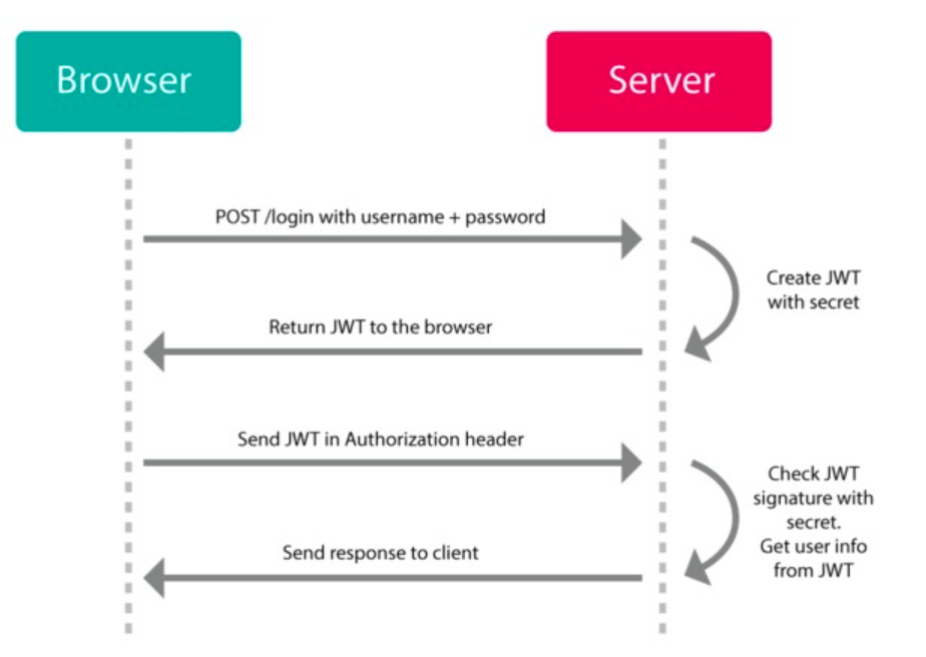
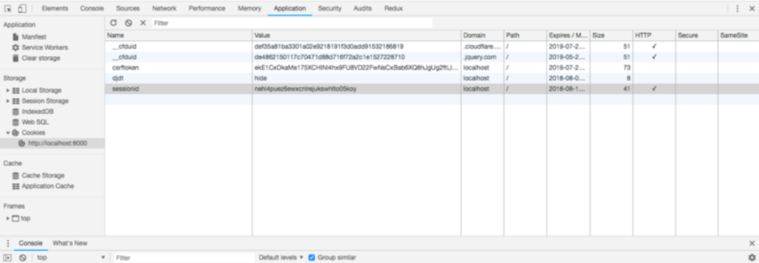

# JWT 

## JWT 란

쿠키랑 굉장히 비슷한데, json format으로 되어있다. 

브라우저가 POST 형식으로 Server에다가 적절한 username과 password를 보내게 되면, 서버는 jwt를 생성하고 브라우저에게 JWT token을 돌려준다. 

이제 브라우저는 서버에게 request를 할때마다 jwt token을 Authorization header 부분에 넣어서 같이 보내줘야 한다. 

서버에 로그인을 하고, 서버로부터 jwt token 을 받아서, 저장한 후에, 서버에 request할때마다 jwt token을 항상 같이 보내주면 된다. 서버는 브라우저로부터 이 jwt token을 받아서 해당 유저를 식별할 수 있게 되는 것이다. 서버는 유저에 대한 모든 정보를 JWT 로부터 받아 올 수 있다. 

## 인증(authentication)은 어떻게 이루어질까?

request안의 유저는 어디서 오는걸까?

검사 -> Application -> Storage -> Cookies 안에 보면 sessionId 라는게 있다. 바로 여기서 user는 불려오고 있는 것이다.

만약   이 세션아이디를 지우고 feed를 받는 url로 이동하면  AttributeError가 나올것이다.

그 이유는 sessionID가 없는 cookie가 되어 익명유저가 되었기 때문이다.

내가 쿠키를 삭제하면, 완전 망한다는 소리다. 장고 서버는 내가 누군지 전혀 알지 못하게된다. 

그래서 쿠키 말고 JWT(Json Web Token) 라는 토큰을 사용한다.

## JWT사용 이유 - API 사용할 때 JWT 인증

인증할 때 **세션-쿠기**를 쓸 것인가? **API토큰**을 쓸 것인가?

**세션**을 쓰면 각 서버가 세션을 관리해서 sticky로 구성하거나, 세션스토어를 따로 두어서 처리해야한다.

**API 토큰**을 쓰는 경우에는 이를 디비에 넣어놓고 관리하게 된다.(JWT)

**토근**이란  것은 만료시간을 가진 임의의 문자열로 같은 토큰이 오면 같은 사람으로 인식한다.

**JWT의 장점**

1.유효한 사용자라는 자체 인증권한을 가짐.

2.억세스키(단기키) 사용시 db 조회없이 인증 정보 획득 가능

3.유효한 권한을 가진다는 부분을 payload 에 넣을 수 있음 (헤더 크기증가, 적용 딜레이, 결국 권한 db조회를 감수한다면)

**JWT의 단점**

1.서버db 사용자 권한이 바뀐 경우 즉시 적용되지 않고 리프레쉬키 (억세스키 재발급) 적용시점까지 시간 걸림(리프레쉬키 적용시는 필히 권한 db 조회해야 함)

2.jwt payload 내에 사용 권한 부분을 넣고 db내 권한 정보를 전혀 조회하지 않게 하려면 헤더가 심하게 길어질 수 있으며 보안 문제도 생김  

**JWT 사용 최적 환경**

1.작업수가 작고

2.사용자 권한 범위가 간단하고 변경이 잦지 않으며

3.사용자수가 많은 경우